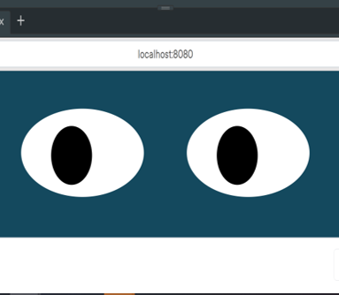

# Eyes Movement

This exercize is showcasing how a mouse movement event is used to update the position of the "eye" element displayed on the page.

## Task Description

My task in this activity is twofold:

* **Task 1**: Add a second "eye" element
* **Task 2**: Have that element follow the mouse position on the screen using mouse events leveraging for () loop with the correct format & styling and correct movement

 ## Installation

* **Step 1**: Download all documents from the Eyes file: Index.html, eyes.js, README.md files, styles.css, and eyes.png
* **Step 2**: Open the Index.html file

 ## Usage

* **#1** When you open the Index.html file, two eyes should appear on the screen.
* **#2** When you move the mouse, the eyes should update (change) their position on the page following the mouse movements

## Support

You can email me at cpodgurschi@gmail.com for help regarding this project. 

## Roadmap

Changing the eye color, when the eye movement reaches certain coordinates

## License information
No applicable license at this time. 